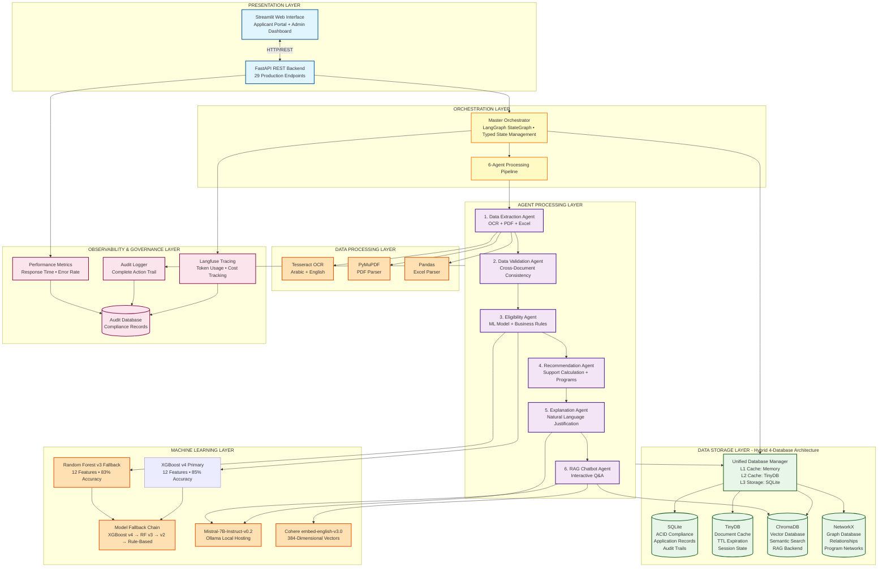
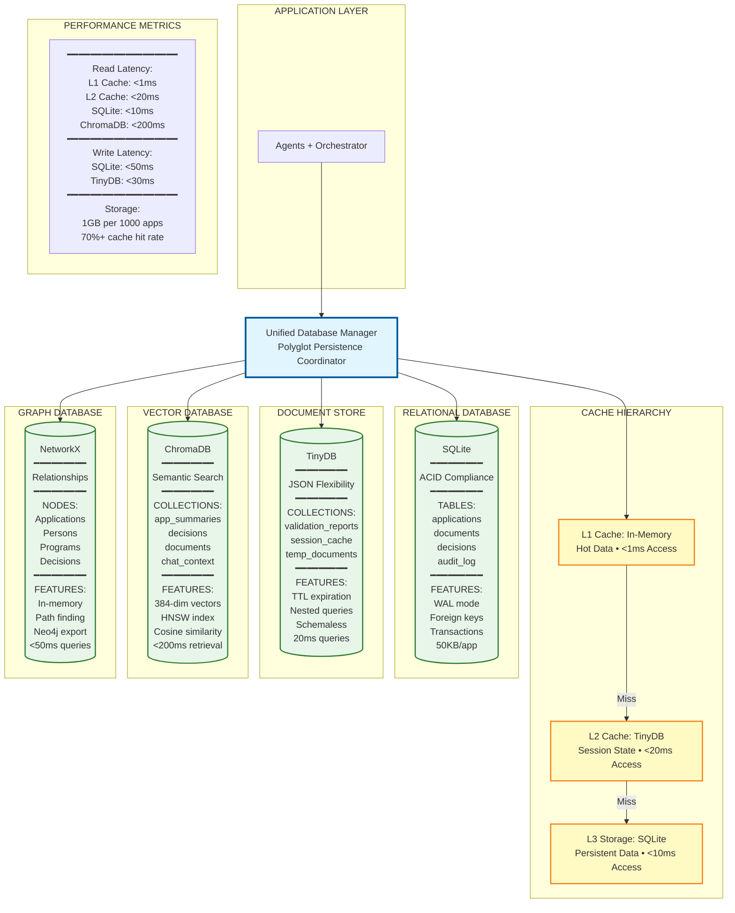
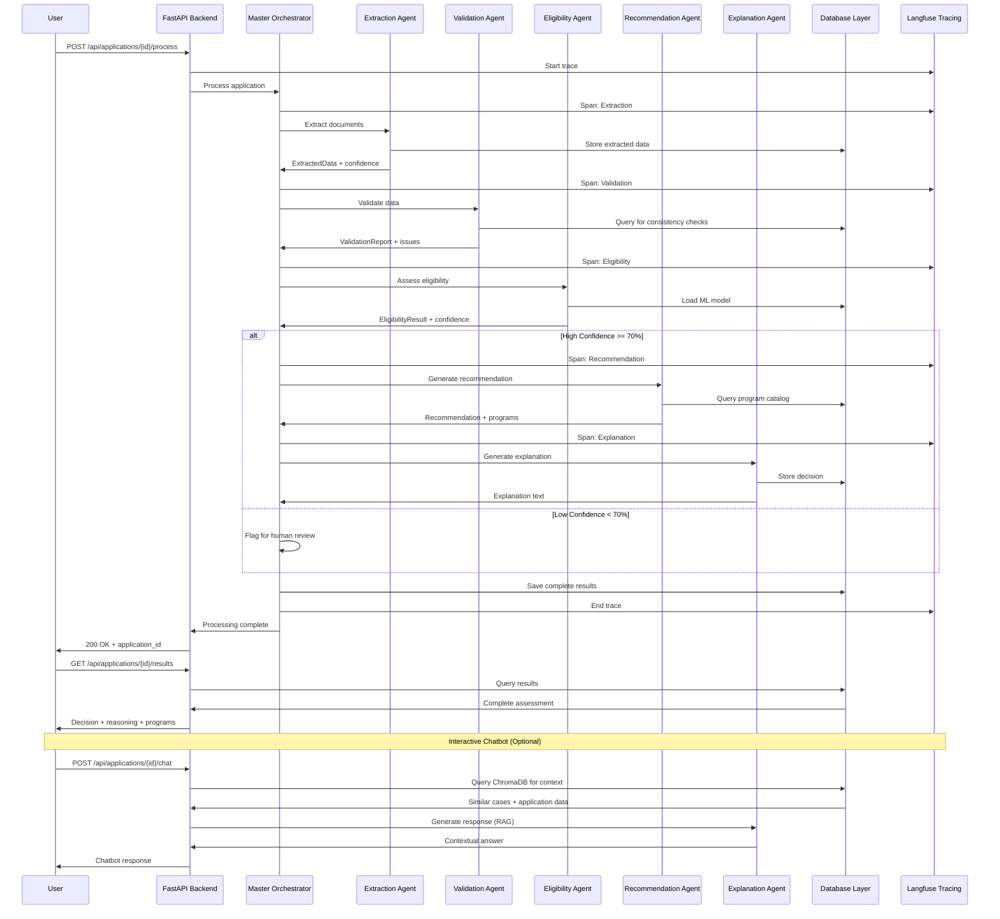
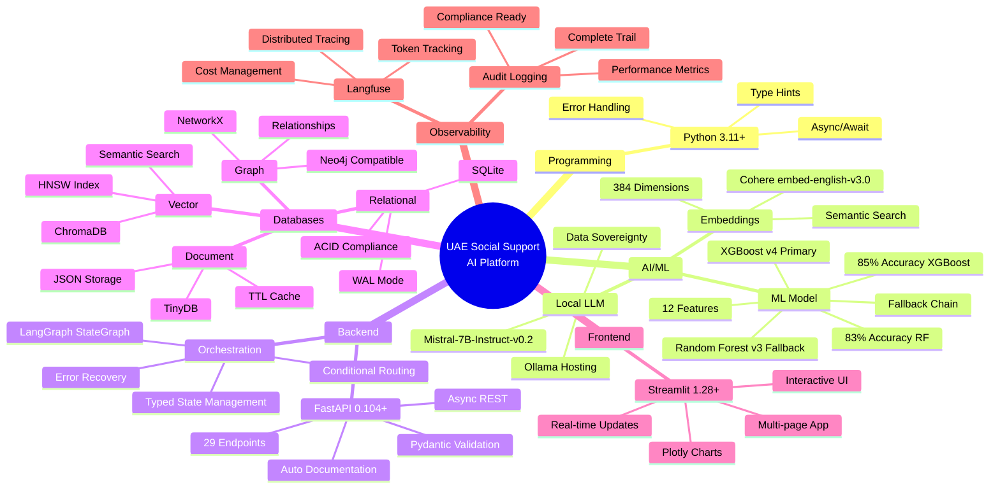
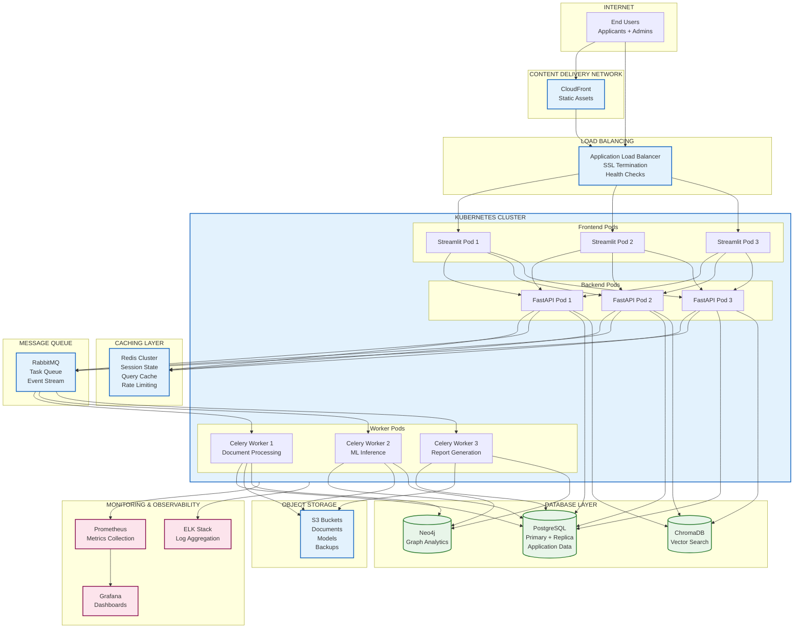

# System Architecture Diagram

## Overview

This document contains the system architecture diagram for the UAE Social Support AI Platform in Mermaid format. You can render this in multiple ways:

1. **GitHub**: Paste the Mermaid code directly in a .md file - GitHub will render it automatically
2. **Online Renderer**: Visit https://mermaid.live and paste the code below
3. **VS Code**: Install "Markdown Preview Mermaid Support" extension
4. **Export to PNG/PDF**: Use mermaid-cli (`mmdc -i ARCHITECTURE_DIAGRAM.md -o architecture.png`)

---

## Full System Architecture



---

## Data Flow Diagram - Application Processing Pipeline

```mermaid
flowchart TD
    Start([User Uploads Documents]) --> Upload[Document Upload<br/>PDF • JPEG • XLSX]
    
    Upload --> Extract[STAGE 1: EXTRACTION<br/>60 seconds<br/><br/>Multi-Modal Processing:<br/>OCR for scanned docs<br/>PDF parsing<br/>Excel analysis<br/>Confidence scoring]
    
    Extract --> Validate[STAGE 2: VALIDATION<br/>30 seconds<br/><br/>Cross-Document Checks:<br/>Identity verification 95% threshold<br/>Financial consistency<br/>Completeness assessment<br/>Issue ranking]
    
    Validate --> Eligible[STAGE 3: ELIGIBILITY<br/>45 seconds<br/><br/>ML Assessment:<br/>XGBoost v4 primary inference<br/>Random Forest v3 fallback<br/>12-feature extraction<br/>Confidence scoring<br/>Hybrid ML + rules]
    
    Eligible --> Recommend[STAGE 4: RECOMMENDATION<br/>30 seconds<br/><br/>Decision Generation:<br/>Support amount AED 500-5000<br/>Program matching 7 initiatives<br/>Priority ranking<br/>Decision category]
    
    Recommend --> Explain[STAGE 5: EXPLANATION<br/>45 seconds<br/><br/>Justification:<br/>Natural language generation<br/>Personalized guidance<br/>Appeals information<br/>Empathetic tone]
    
    Explain --> Decision{Decision<br/>Confidence}
    
    Decision -->|High > 70%| AutoApprove[Automated Decision<br/>APPROVED / CONDITIONAL / REJECTED]
    Decision -->|Low < 70%| HumanReview[Human Review Required<br/>Edge Case Handling]
    
    AutoApprove --> Results[Results Display<br/>Decision banner<br/>Support amount<br/>Recommended programs<br/>Reasoning]
    HumanReview --> Results
    
    Results --> Chat[INTERACTIVE SUPPORT<br/>RAG Chatbot<br/><br/>On-Demand Q&A:<br/>Semantic search<br/>Contextual responses<br/>Session management<br/>Audit trail]
    
    Chat --> End([Complete Process<br/>Total Time: 4-5 minutes])

    %% Styling
    classDef stage fill:#e3f2fd,stroke:#1565c0,stroke-width:2px
    classDef decision fill:#fff3e0,stroke:#e65100,stroke-width:3px
    classDef endpoint fill:#e8f5e9,stroke:#2e7d32,stroke-width:2px
    
    class Extract,Validate,Eligible,Recommend,Explain stage
    class Decision decision
    class Start,End,Results,Chat endpoint
```



---

## Database Architecture Diagram



---

## Agent Interaction Diagram



---

## Technology Stack Diagram



---

## Deployment Architecture (Future State)



---

## How to Use These Diagrams

### Option 1: Render in GitHub
1. Create a file `ARCHITECTURE_DIAGRAM.md` in your repository
2. Copy the Mermaid code blocks above
3. Push to GitHub - it will render automatically

### Option 2: Export to PNG/PDF
```bash
# Install mermaid-cli
npm install -g @mermaid-js/mermaid-cli

# Export to PNG
mmdc -i ARCHITECTURE_DIAGRAM.md -o architecture.png -w 2400

# Export to PDF
mmdc -i ARCHITECTURE_DIAGRAM.md -o architecture.pdf -w 2400
```

### Option 3: Use Online Renderer
1. Visit https://mermaid.live
2. Paste the Mermaid code
3. Download as SVG, PNG, or PDF
4. Customize styling and colors as needed

### Option 4: VS Code Preview
1. Install "Markdown Preview Mermaid Support" extension
2. Open this file in VS Code
3. Press `Ctrl+Shift+V` (Windows/Linux) or `Cmd+Shift+V` (Mac)
4. View rendered diagrams in preview pane

---

## Diagram Descriptions

**Full System Architecture**: Complete 6-layer architecture showing all components and their interactions

**Data Flow Diagram**: Step-by-step processing pipeline from document upload to final decision

**Database Architecture**: Detailed view of the 4-database hybrid strategy with cache hierarchy

**Agent Interaction Diagram**: Sequence diagram showing agent coordination and message passing

**Technology Stack Diagram**: Mind map of all technologies organized by category

**Deployment Architecture**: Future-state production deployment with Kubernetes and cloud services

---


